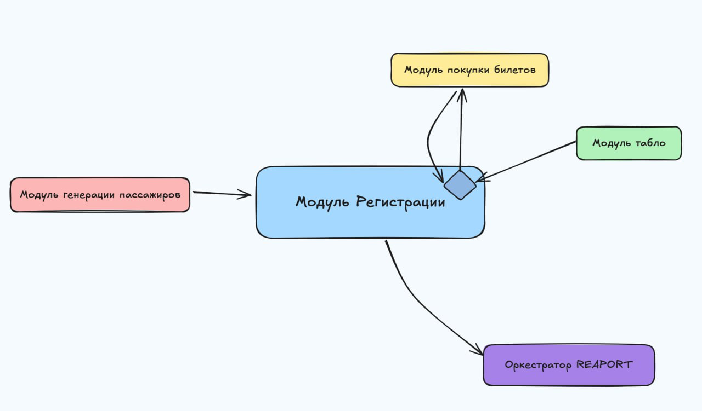
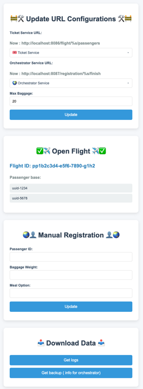

# ✈️ Модуль регистрации пассажиров на рейс
[](https://docs.reaport.ru/?urls.primaryName=register#/default/post_passenger)

Данный модуль является ключевым элементом системы автоматизированной регистрации пассажиров на авиарейсы в проекте **REAPORT**. Он предоставляет функциональность для регистрации пассажиров с возможностью выбора или изменения типа питания, а также сдачи багажа с контролем его веса. После завершения регистрации информация о багаже и питании передается оркестратору аэропорта для дальнейшей обработки.

---

## 📋 Функциональные возможности:

- **Регистрация пассажиров**:
  - Регистрация доступна только для пассажиров с действующими билетами на открытый для регистрации рейс.
  - Возможность смены питания доступна только до закрытия регистрации. Если предпочтения по питанию не указаны, используется вариант по умолчанию из модуля покупки билетов.
  - Модуль позволяет пассажирам сдать багаж, при этом вес багажа не должен превышать установленный авиакомпанией лимит — **20 кг**.
  - В случае превышения допустимого веса система уведомляет пассажира и предлагает скорректировать вес багажа.
  - Во время регистрации пассажир получает все необходимые сведения о рейсе, включая:
    - Название рейса.
    - Время начала посадки.
    - Время вылета.
    - Место в самолёте, указанное в билете.

- **Получение сведений о рейсе**:
  - Основные сведения о рейсе запрашиваются у модуля табло.
  - Система автоматически получает информацию о пассажирах, купивших билеты на данный рейс, с помощью запроса к модулю покупки билетов.

- **Отправка данных оркестратору**:
  - По завершении регистрации, информация о количестве и типах выбранного питания, а также данные о сданном багаже передаются оркестратору аэропорта.
  - Оркестратор получает данные в виде структурированного отчета для организации дальнейших процессов по подготовке рейса.
  - Все отчёты сохраняются в файл для сохранения целостности данных в случае потери связи с оркестратором

## 🔗🤝 Интеграция 


## 🚀 Установка и запуск

Для локального запуска приложения можно воспользоваться командами:
* ``docker-compose up``
  
Варианты без docker:
* ``make run``
* ``go run cmd/main.go``

#### Mock - сервисы (эмулирующие работы интеграционных сервисов) :
*  ``make run_ticket`` покупка билетов
*  ``make run_orchestrator`` оркестратор

## 🌍 Развертывание 

Модуль регистрации пассажиров развернут с использованием контейнерной архитектуры. Для этого был создан **Docker Compose** файл, который позволяет запускать сервис вместе с эмулирующими интеграциями и необходимыми внешними сервисами. Благодаря этому подходу, система легко масштабируется и готова к быстрому развёртыванию в любой среде.

### 📦 Инструменты и технологии

- **Docker Compose** — для упрощенного управления контейнерами и развертывания всех зависимостей сервиса регистрации.
- **Dockploy** — для автоматизации процесса деплоя, что позволяет легко управлять версиями и обновлениями сервиса.
- **Nginx** — для обеспечения работы сервиса по протоколу HTTPS с привязкой домена.
- **Let's Encrypt** — для автоматической генерации SSL-сертификатов, чтобы обеспечить безопасное соединение через HTTPS.

### 🖥 Домен и доступ

Модуль регистрации доступен по домену:

- **Домен**: `https://register.reaport.ru`
- **Протокол**: HTTPS для безопасности данных.

### 🛠⚙️ Административная панель

Для управления сервисом регистрации и мониторинга его состояния предусмотрена административная панель, которая доступна по следующему адресу:

- **Адрес админки**: [https://register.reaport.ru/data](https://register.reaport.ru/data)

Панель предоставляет удобный интерфейс для отслеживания и изменения ключевых метрик работы модуля:

* 🔗 Изменение URL сервисов ticket и orchestrator (prod и mock)
* 📊 Просмотр актуальных для регистрации рейсов с пассажирами с действующими билетами
* 👤 Ручная регистрация на рейс
* 🌐 Загрузка логов программы
* ✈️ Загрузка отчета о завершенных рейсах (backup связи с оркестратором)



### ⚙️ Конфигурация 
`Файл: config.json`

```json
{
  "mealOption":  ["Standard", "Vegetarian", "Vegan", "Gluten-Free"],
  "maxBaggage" : 20.0,
  "urlTicketService": "https://tickets.reaport.ru/flight/%s/passengers",
  "urlOrchestrator": "https://orchestrator.reaport.ru/registration/%s/finish",
  "mockUrlTicketService": "http://138.124.14.247:8086/flight/%s/passengers",
  "mockUrlOrchestrator": "http://138.124.14.247:8087/registration/%s/finish"
}
```

* `mealOption` - Доступные типы питания, которые можно сменить до окончания регистрации
* `maxBaggage` - Максимально возможный размер багажа
* `urlTicketService` - URL модуля покупки билетов
* `urlOrchestrator` - URL модуля оркестратора 
*  `mockUrlTicketService` - URL mock- модуля покупки билетов
* `mockUrlOrchestrator` - URL mock -модуля оркестратора

## 🛫 Описание API 

API модуля регистрации пассажиров предоставляет функциональность для взаимодействия с системой регистрации на рейс. Ниже представлено описание ключевых конечных точек API, используемых для регистрации пассажиров и получения информации о рейсах.

### 🌐 Основные сведения API

- **Версия API**: 1.0.0
- **Описание**: API для модуля регистрации пассажиров на рейс
- **Протокол**: HTTPS
- **Домен**: `https://register.reaport.ru/`

### 📋 Таблица методов API

| **Метод** | **Эндпоинт**                | **Описание**                                                   | **Ответы**                                                                                           |
|-----------|-----------------------------|----------------------------------------------------------------|------------------------------------------------------------------------------------------------------|
| `POST`    | `/passenger`                | Регистрация пассажира на рейс, получение информации о рейсе     | `200`: Успешная регистрация, `400`: Неверный запрос, `404`: Пассажир не найден, `500`: Ошибка сервера |
| `POST`    | `/flights`                  | Получение информации о рейсе для регистрации                    | `200`: Рейс успешно зарегистрирован, `400`: Неверный запрос, `500`: Ошибка сервера, `502`: Ошибка получения данных о пассажирах на рейс |

---

### ✈️ Методы API

#### 1. `POST /passenger`

Эндпоинт для регистрации пассажира на рейс. Модуль использует данные пассажира и информацию о его багаже и предпочтениях питания для завершения регистрации.

- **Описание**: Регистрация пассажира с указанием веса багажа и выбора питания.
- **Параметры запроса**:
  - `passengerId` (UUID) — Уникальный идентификатор пассажира.
  - `baggageWeight` (float) — Вес багажа в кг (макс. 20 кг).
  - `mealOption` (string) — Тип питания (стандартное, вегетарианское, веганское, безглютеновое).

- **Пример запроса**:
    ```json
    {
      "passengerId": "123e4567-e89b-12d3-a456-426614174000",
      "baggageWeight": 12.5,
      "mealOption": "Vegetarian"
    }
    ```

- **Ответы**:
  - `200 OK` — Успешная регистрация пассажира.
    ```json
    {
      "flightName": "SU-1234",
      "departureTime": "2023-10-15T14:30:00Z",
      "startPlantingTime": "2023-10-15T14:10:00Z",
      "seat": "A2"
    }
    ```
  - `400 Bad Request` — Неверный запрос (ошибка валидации или превышение веса багажа).
  - `404 Not Found` — Пассажир не найден.
  - `500 Internal Server Error` — Внутренняя ошибка сервера.

#### 2. `POST /flights`

Эндпоинт для получения информации о рейсе, который доступен для регистрации. Этот метод запрашивает данные о рейсе у модуля табло и возвращает необходимые сведения для регистрации.

- **Описание**: Получение данных о рейсе, таких как время вылета, время окончания регистрации, время начала посадки и рассадка пассажиров.
- **Параметры запроса**:
  - `flightId` (UUID) — Уникальный идентификатор рейса.
  - `flightName` (string) — Название рейса.
  - `endRegisterTime` (date-time) — Время окончания регистрации.
  - `departureTime` (date-time) — Время вылета.
  - `startPlantingTime` (date-time) — Время начала посадки.
  - `seatsAircraft` (array) — Массив мест в самолёте (номера мест и класс).

- **Пример запроса**:
    ```json
    {
      "flightId": "a1b2c3d4-e5f6-7890-g1h2-i3j4k5l6m7n8",
      "flightName": "SU-1234",
      "endRegisterTime": "2023-10-15T13:30:00Z",
      "departureTime": "2023-10-15T14:30:00Z",
      "startPlantingTime": "2023-10-15T14:10:00Z",
      "seatsAircraft": [
        {"seatNumber": "1A", "seatClass": "business"},
        {"seatNumber": "1B", "seatClass": "business"},
        {"seatNumber": "2A", "seatClass": "economy"},
        {"seatNumber": "2B", "seatClass": "economy"}
      ]
    }
    ```

- **Ответы**:
  - `200 OK` — Рейс успешно зарегистрирован.
  - `400 Bad Request` — Неверный запрос (ошибка валидации).
  - `500 Internal Server Error` — Внутренняя ошибка сервера.
  - `502 Bad Gateway` — Ошибка получения пассажиров на рейс из модуля покупки билетов.

---

### 📑 Форматы данных

#### Регистрация пассажира — `RegisterPassengerRequest`

| Поле           | Тип        | Описание                                                                 |
|----------------|------------|--------------------------------------------------------------------------|
| `passengerId`  | `string`   | Уникальный идентификатор пассажира (UUID)                                |
| `baggageWeight`| `float`    | Вес багажа (в кг), не более 20 кг                                        |
| `mealOption`   | `string`   | Тип питания: "Standard", "Vegetarian", "Vegan", "Gluten-Free"             |

#### Ответ на регистрацию — `RegisterPassengerResponse`

| Поле                | Тип        | Описание                                      |
|---------------------|------------|-----------------------------------------------|
| `flightName`        | `string`   | Название рейса                                |
| `departureTime`     | `string`   | Время вылета (формат `date-time`)             |
| `startPlantingTime` | `string`   | Время начала посадки (формат `date-time`)     |
| `seat`              | `string`   | Место пассажира в самолёте                    |

#### Запрос информации о рейсе — `FlightStatusRequest`

| Поле               | Тип        | Описание                                      |
|--------------------|------------|-----------------------------------------------|
| `flightId`         | `string`   | Уникальный идентификатор рейса (UUID)         |
| `flightName`       | `string`   | Название рейса (номер)                        |
| `endRegisterTime`  | `string`   | Время окончания регистрации (формат `date-time`) |
| `departureTime`    | `string`   | Время вылета (формат `date-time`)             |
| `startPlantingTime`| `string`   | Время начала посадки (формат `date-time`)     |
| `seatsAircraft`    | `array`    | Список мест в самолёте                        |


